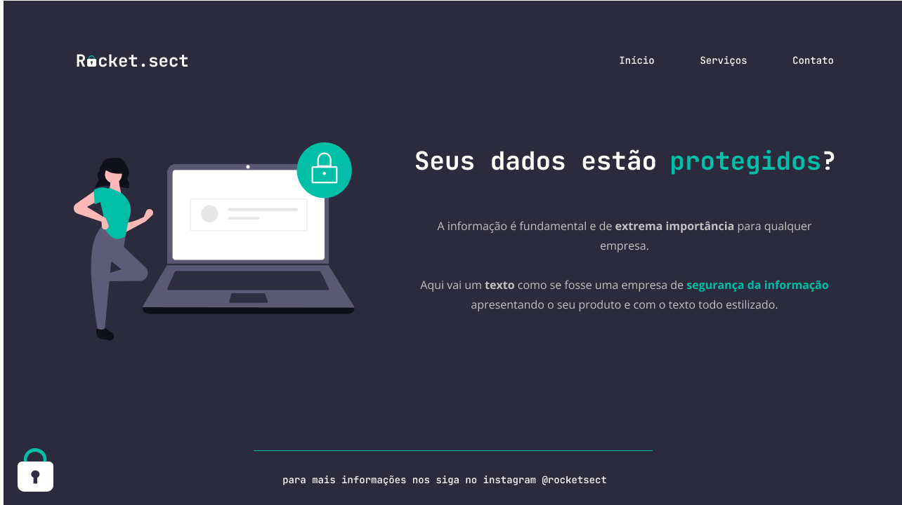

O objetivo do desafio é recriar uma aplicação, a partir de um layout,para treinar o que aprendeu nas aulas do Stage 02.

Desafio em concluído!

Obs: O layout sofre uma alteração em uma tela maior, recomendo que você acesse o site em
 uma tela menor(EX: tela de notebook)
